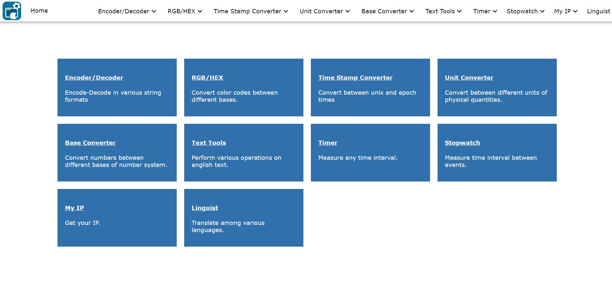
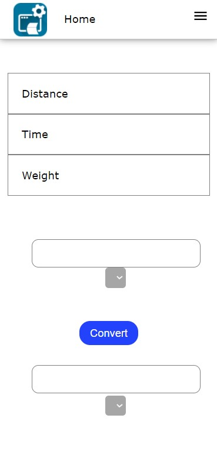
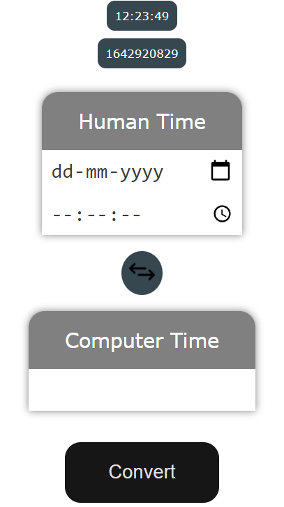
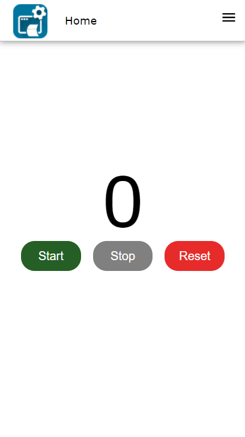

# utilityapp1
A website which contains few of the most commonly used utility tools. 
https://utility-tools-app.netlify.app/

## Utility Tools
- Text Encoder/Decoder
- RGB-HEX color code converter
- Time Stamp Converter
- Measuring Units Converter
- Number Base Converter
- Text Transformer

## Technologies used
- html
- css
- Javascript
- Netlify

## UI
### Landing page

Unit Converter | Time Stamp converter | Stop Watch
--- | --- | ---
 |  | 
